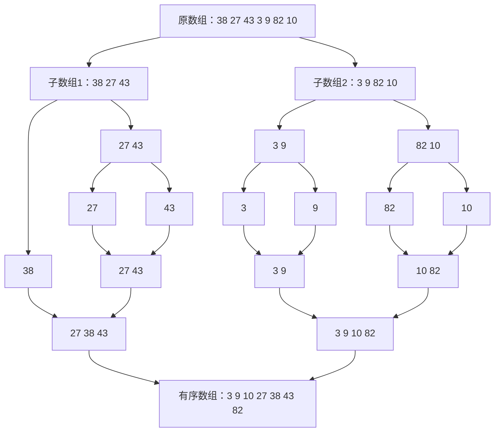

# 排序算法

------

## 1.归并排序

采用**分治策略**，将大问题划分为小问题，直到拆分为最小单元，在两两**合并为有序序列**，最终完成整体有序。

### 特性

**时间复杂度：**始终为$O(nlogn)$

**空间复杂度**：$O(n)$

**稳定性**：稳定性强

### 递归图



### Python代码（递归版）

```python
def merge_sort(arr):
    if len(arr) <= 1:
        return arr
    
    mid = len(arr) // 2
    left = merge_sort(arr[:mid]) # 左数组
    right = merge_sort(arr[mid:]) # 右数组
    return merge(left, right)

# 合并排序后的数组
def merge(left, right):
    result = []
    i = j = 0
    while i < len(left) and j < len(right):
        if left[i] <= right[j]:
            result.append(left[i])
            i += 1
        else:
            result.append(right[j])
            j += 1
    result.extend(left[i:])
    result.extend(right[j:])
    return result
```

### Python代码（非递归）

```python
def Sort(arr):
    n = len(arr)

    temp = [0] * n
    step = 1

    while step < n:
        left = 0

        while left < n:
            mid = min(left+step, n)
            right = min(left+2*step, n)

            if mid < right:
                i,j,k = left, mid, left
                temp[left:right] = arr[left:right]

                while i < mid and j < right:
                    if temp[i] <= temp[j]:
                        arr[k] = temp[i]
                        i += 1
                        k += 1
                    else:
                        arr[k] = temp[j]
                        j += 1
                        k += 1
                
                while i < mid:
                    arr[k] = temp[i]
                    i += 1
                    k += 1
                while j < right:
                    arr[k] = temp[j]
                    j += 1
                    k += 1
            left += 2*step
        
        step *= 2

    return arr
```

**总结**：总之，归并排序是使数组有序后再合并。

### 有关归并排序的题型

#### 适用范围

1. 左部分的答案+右部分的答案+跨越左右产生的答案
2. 计算”跨越左右产生的答案“时，如果加上左右部分各自有序，会不会获得计算的便利性
3. 如果以上两点成立，则可用归并分治解决。


## 2.随机快速排序

**随机选择**一个基准值，分为三个区域：`[小于基准值]` 基准值 `[大于基准值]`, 对左右区间进行递归，重复之前的过程。

### 基本原理

假设有一个**无序数组**`arr`，有以下几个步骤：

1. 随机选择一个基准值`x`，用`a`表示**左区间末尾位置**，用`b`表示**右区间末尾位置**
2. 遍历数组`a`，使用`i`作为索引，返回a，b的值：
   - 当**arr[i] < x**，arr[a]和arr[i]交换，a++， i++
   - 当**arr[i]==x**，i++
   - 当**arr[i] > x**，arr[b]和arr[i]交换，b--
   - **当 i > b**，三个区域分类完成
3. 使用递归，重复1，2步骤。

### Python代码

```python
import random

def random_quicksort_simple(arr):
    """
    使用列表推导式的随机快速排序实现
    优点：代码简洁，易于理解
    缺点：需要额外空间，不是原地排序
    """
    if len(arr) <= 1:
        return arr
    
    # 随机选择枢轴元素
    pivot = arr[random.randint(0, len(arr) - 1)]
    
    # 将数组分为三部分
    left = [x for x in arr if x < pivot]
    middle = [x for x in arr if x == pivot]
    right = [x for x in arr if x > pivot]
    
    # 递归排序并合并
    return random_quicksort_simple(left) + middle + random_quicksort_simple(right)
```


## 3. 堆结构和堆排序

使用**二叉树结构**，堆有向上调整（heapInsert）和向下调整（heapify）两种调整方式。堆的定义分为**大根堆**（每个父节点都是最大值）和**小根堆**（每个父节点都是最小值）。时间复杂度为：**O(nlogn)**，空间复杂度为：**O(n)**

为了确定索引**i**的父节点、左节点和右节点，有以下公式：
$$
父节点：\frac{i-1}{2} \\
左节点：i \times 2+1  \\
右节点：i \times 2+2
$$

### 向上调整（大根堆）

```python
# 向上调整
# arr[i] = x，往上看，若比父亲大，交换值，直到不比父亲大或到顶点
def heapInsert(arr, i):
    while (arr[i] > arr[int((i - 1)/2)]):
        arr[int((i - 1)/2)], arr[i] = arr[i], arr[int((i - 1)/2)]
        i = int((i - 1)/2)

```

### 向下调整（大根堆）

```python
# i位置上的数变小了
# 向下调整
def heapify(arr, i, size):
    # 左节点
    l = i * 2 + 1
    while (l < size):
        # 右节点
        # 评选 
        # 1. 左节点值与右节点比较
        best = l + 1 if l + 1 < size and arr[l] < arr[l+1] else l
        # 2.最大节点的值与父节点比较
        best = best if arr[best] > arr[i] else i

        if (best == i):
            break

        arr[i], arr[best] = arr[best], arr[i]
        i = best
        l = i * 2 + 1
```

### 堆排序

#### 从顶到低建堆

从顶到低建堆，**O(nlogn)**
依次弹出堆内最大值并排序，**O(nlogn)**
整体时间复杂度 **O(nlogn)**

```python
# 堆排序
def heapSort(arr):
    n = len(arr)
    # 向上调整
    for i in range(n):
        heapInsert(arr, i)

    size = n
    while (size > 1):
        arr[0], arr[size - 1] = arr[size - 1], arr[0]
        size -= 1
        heapify(arr, 0, size)
```

#### 从低到顶建堆

从低到顶建堆，**O(n)**
依次弹出堆内最大值并排序，**O(nlogn)**
整体时间复杂度 **O(nlogn)**

```python
# 堆排序
def heapSort(arr):
    n = len(arr)
    for i in range(n-1, -1, -1):
        heapify(arr, i, n)

    size = n
    while (size > 1):
        arr[0], arr[size - 1] = arr[size - 1], arr[0]
        size -= 1
        heapify(arr, 0, size)
```


## 4、基数排序

不基于比较的排序，对数据要求有要求。时间复杂度和空间复杂度都是 **O(n)**

### Python代码

```python
def BaseSort(arr:list[int], bits:int, base:int = 10):
    '''
    :param arr: 待排序数组
    :type arr: list[int]
    :param bits: 数组中最大值的位数
    :type bits: int
    :param base: 进制数
    :type base: int
    '''

    offest = 1
    n = len(arr)
    helpArr = [0] *  n
    for i in range(bits):
        cnts = [0] * base  # 计数数组
        for j in range(n):
            # 提取某一位
            cnts[(t[j] // offest) % base] += 1
        
        # 前缀和分数量区间
        for j in range(1, base):
            cnts[j] = cnts[j] + cnts[j - 1]

        for j in range(n-1, -1, -1):
            idx = cnts[(t[j] // offest) % base]
            helpArr[idx - 1] = t[j]
            cnts[(t[j] // offest) % base] -= 1
        
        for j in range(n):
            arr[j] = helpArr[j]
        
        offest *= 10
```


## 总结

1. 性能优异、不在乎稳定性：**随机快排**
2. 性能优异、忽略额外空间、具有稳定性：**归并排序**
3. 性能优异、额外空间占用为0(1)、不在乎稳定性：**堆排序**

